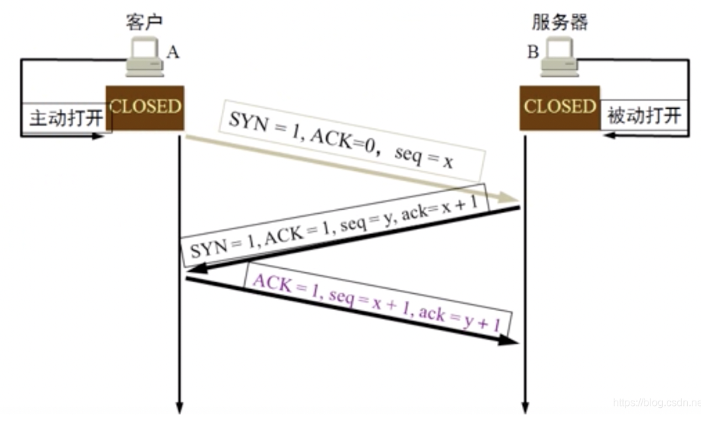
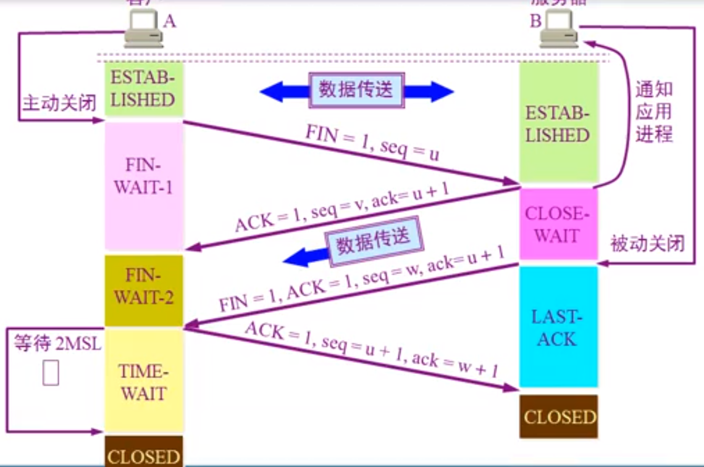

## Computer-Network ##
### 因特网 
网络：许多计算机连接在一起
互联网：许多网络连接在一起（internet）
因特网：全球最大的一个互联网(Internet)   TCP/IP协议

### 因特网的组成 
边缘部分：
1. 通信方式：客户服务器（C/S）、对等方式（P2P）

核心部分：
1. 数据交换：
    + 电路交换（交换机）：适合数据量很大的实时性传输
    + 报文交换：不分段，整体交换
    + 分组交换：可以走不同的路径
2. 广域网：应用了广域网技术
   局域网：应用了局域网技术
### 计算机网络性能：
  1. 速率：主机在计算机网络上数字信道上传送数据位数的速率  比特率 （kb/s Mb/s Gb/s）
  2. 带宽：数据通信领域中，数字信道所能传送的最高数据率
  3. 吞吐量：在单位时间内通过某网络的数据量
  4. 时延：发送时延、传播时延、处理时延、排队时延
  5. 时延带宽积：传播时延×带宽
  6. 往返时间：从发送方发送数据到接收方回复确认（RTT）  cmd: ping  网关
  7. 利用率：信道利用率、网络利用率
### OSI七层模型：分层后有利于标准化，降低相互之间的依赖（高内聚低耦合）
   + **应用层：能够产生网络流量能够和用户交互的应用程序**
     1. 域名系统DNS：将域名解析成IP地址   
     - 域名的跟 .（点）  
     - 顶级域名 .com .edu .org  .cn .net  .gov
     - 二级域名 baidu  inhe
     - 三级域名 www.dba.inhe.com的 dba
     2. 域名解析过程：根DNS知道顶级域名DNS服务器的IP地址   
     3. DHCP 动态主机配置
     - 静态IP地址：IP固定
     - 动态IP地址：用DHCP协议分配
     - DHCP请求IP地址过程：
     4. 文件传输协议FTP：创建2条通信  一条用于控制连接，用于发送FTP命令信息，标准端口为21；一条用于数据连接，用于上传、下载数据，标准端口为20
     - 主动模式：FTP客户端告诉FTP服务器侦听端口  FTP服务器主动连接FTP客户端进行数据传输
     - 被动模式：FTP服务端在指定范围内的某个端口被动等待FTP客户端发起连接
     - FTP传输模式：
         - 文本模式：ASCII模式，以文本序列传输数据
         - 二进制模式：Binary模式，以二进制序列传输数据
     5. 远程终端协议TELNET：远程进行命令传输，默认使用TCP的23端口
     - net user han a! /add  创建一个用户
     - net user administrator a1!  重设密码为a1!
     - net localgroup administrators han /add  加一个han 管理员
     - shutdown -r -t 0  立即关机
     6. 远程桌面协议RDP：远程使用图形端口连接  3389
     7. 超文本传输协议HTTP： URL一般形式：<协议>://<主机>:<端口>/<路径>   对于网站的标识可以使用不同的端口、不同的IP地址、不同的主机头（域名）
     8. 使用Web代理服务器访问网站
     - 节省内网访问Internet的带宽
     - 通过Web代理绕过防火墙
     9. 电子邮件(SMTP发电子邮件、POP3收邮件、IMAP收邮件)
     
   + **传输层：可靠传输建立会话（看电影）  不可靠传输不建立会话（QQ对话）  流量控制** 
     1. TCP协议：分段、编号、流量控制功能、建立会话、可靠连接   传送的是运输协议数据单元是TCP报文段
     2. UDP协议：一个数据包就能完成数据通信、不建立对话、多播、不可靠连接  传送运输协议数据单元是UDP报文或者用户数据报
     3. 传输层与应用层的关系：http=TCP+80端口  https=TCP+443 DNS=UDP+53
     4. 端口代表服务 -> 更改端口增加服务器安全
     5. Windows防火墙作用：主动的请求进不来，自己的请求可以返回
     6. 一些比较熟知的端口号：FTP：21；TELENT：23；SMTP：25；DNS：53；HTTP：80；https：443；RDP：3389
     7. UDP组成：首部（伪首部 ｛源IP地址4位、目的IP地址4位、0、17、UDP长度2位｝+ 12位字节、源端口2位、目的端口2位、长度2位、校验和2位） + 数据
     - 主要特点：UDP不需要提前建立连接、尽最大努力交付、无拥塞控制、支持单播和广播、首部开销小、面向报文的运输层协议
     8. TCP特点：面向连接的运输层协议、只能是点对点连接、提供可靠交付、全双工通信   
     - 点对点连接：TCP连接的端点叫套接字（IP地址：端口号）
     - 可靠交付：停止等待协议（有差错时超时重传） -> 通常称为**自动重传请求ARQ**  信道利用率低  -> 改为流水线传输（传输不停止） 以字节为单位的滑动窗口技术
     - **TCP报文段：TCP首部 [长度不固定 -> 20字节固定 + 可变部分] （16位源端口 + 16位目的端口 + 32位序号 + 32位确认号 + 4位的数据偏移 + 6位保留 + 1位URG（优先级）+1位ACK（决定确认号是否有效 + 1位PSH（直接推送） +1位RST（重新传输） + 1位SYN（建立会话请求） +1位FIN（释放连接）+ 16位窗口（接收缓存容量 + 16位检验和 + 16位紧急指针（URG=1才有用  决定紧急处理的字节范围）+ 可变不补分 ）+ TCP数据部分**
     9. TCP的流量控制：控制点对点的通信量，抑制发送端的发送速率
     10. TCP的拥塞控制：防止网络堵塞，有丢包现象就减少数据发送速度，降低网络传输性能  发送方维持拥塞窗口cwnd
     11. TCP的传输连接管理：三个阶段（ 建立连接（三次握手） 、数据传送和连接释放 [四次分手]  ）
     
   + **网络层：IP地址编址  选择最佳路径**
     1. 网络层向运输层提供的两种服务：
     * 虚电路服务：只是一条逻辑上的连接（静态路由）
     * 数据报服务：提供简单灵活的、无连接的、尽最大努力交付于的数据报服务（动态服务）
     2. 网际协议IP：
         + 虚拟互联网：中继系统（中间设备）-> 转发器（物理层）、网桥（数据链路层）、路由器（网络层）、网关（网络层以上）  网际协议IP是TCP/IP两个主要协议之一，与IP配合使用的还有四个协议：ARP(RARP)、ICMP、IGMP
         + IP地址：32位的IP地址分为网络ID和主机ID
             - A类地址：1-126
             
             - B类地址：128.1-191.255    
             
             - C类地址：192.0.1-223.255.255    （等分2\4\8个子网   变长子网划分）
             
             - 子关掩码：255为网络部分/0为主机部分    作用：告诉计算机网络部分和主机部分    子网划分技术：网关一般是此网段的第一个地址   **C类分网段方法（等分和不等分[变长子网划分]）**   特例：点对点的子关掩码 255.255.255.252/30
             
             - 超网：合并网段   能让不同网段的网连接起来
             
             - IP地址+MAC地址：{ [ 数据段或消息+源IP地址+目标IP地址 ] -> 数据包 | + 源MAC+目标MAC } -> 数据帧
             
             - ARP协议：通过广播负责把IP地址解析成MAC地址
             
             - 数据报：首部的前一部分为固定长度，共20字节；后半部分可选字段
             
             - 固定部分字段：版本（IPv4还是IPv6）4位、首部长度（确定首部长度）4位、区分服务（优先级）8位、总长度（数据报）16位、标识（计数器|多一份数据报就+1）16位、标志（分片情况）3位、片偏移（某片在原分组的相对位置）13位、生存时间（TTL/可通过路由器的最大值）8位、协议（数据使用哪种协议）8位、首部校验和（检验首部有没有错误）16位、IP源地址32位、IP目标地址32位
             - IP转发分组流程   网络畅通条件：数据包能去能回（静态路由配置）
             - 网关就是默认路由（信息网络的出口） 查看路由表 route print / netstat -r
             - 网络负载均衡：指定一条路线去一条路线回
             - ICMP：提高IP数据报交付成功的机会  报文格式：类型8位、代码8位、检验和16位、数据部分（取决于类型） -> 类型：ICMP差错报告报文和ICMP询问报文
                 * 差错报告报文：终点不可达、源点抑制、时间超过、参数问题、改变路由
                 * 询问报文：回送请求和回答报文、时间戳请求和回答报文
             - RIP（动态路由协议）: 周期性广播   不考虑带宽只考虑跳数  最大跳数15跳
               
               OSPF（内部网关协议）：开放式最短路径优先协议  根据带宽选择路径  触发式更新  支持多区域  tracert IP
               BGP（外部网关协议）：不同自治系统的路由器之间交换路由信息的协议   VPN拨号  ***NAT —> 网络地址转换技术：***   端口映射：让外网的人通过公网能够访问私网的服务器
             - IGMP组播协议：管理组播成员   点到点通信：对于广播 -> MAC地址全是F 目标IP地址全是255  全网广播不能跨越路由器      组播=多播：分组广播
     
+ **数据链路层：数据如何封装 添加物理层地址（MAC地址）**
       1. 主要使用的信道：①点对点信道；②广播信道（一对多）
           2. 链路：一条点对点的物理线段，一条通路的组成部分；数据链路：要有通信协议控制数据传输（硬件、软件） -> 链路上即数据链路
           3. 传送数据形式：帧  
           4. 三个基本问题：封装成帧、透明传输、差错控制
           * 封装成帧：在一段数据的前后分别添加首部和尾部然后构成了一个帧，进行帧定界(收到的帧不完整直接抛弃)
           * 透明传输：为了防止帧数据中产生帧开始符和帧结束符，会在字符“SOH”和"EOT"以及“ESC”前面插入一个"ESC"，这叫字符填充（字节填充），接收端的数据链路层将在数据送往网络成之前删除转义字符。
           * 差错校验：比特差错-->1可能变成0，0也可能变成1 --> 误码率（BER）和信噪比关系很大
               - 循环冗余检验（CRC）—> 余数（FCS）   不纠错、不要求重新传输
               - 帧检验序列（FCS）
             5. 点对点的数据链路传输：PPP协议（拨号上网  身份验证功能）  PPP协议帧格式（字节填充、零比特填充）
             6. 使用广播信道的数据链路层：以太网  带冲突检测的载波监听/碰撞检测 （CSMA/CD协议） 信道利用率    载波监听多点接入/碰撞检测机制 ：
            * 多点接入：许多计算机以多点接入的方式连接在一根总线上
            * 载波监听：检测总线上有没有其他计算机发送数据信号，避免碰撞（冲突检测和避让机制） -> 二进制指数类型退避算法  至少有64字节的测试帧  争用期为51.2微秒  争用期可发送521bit 也就是64字节帧
             7. 局域网拓扑：星形网、环形网、总线网、树形网 -> 共享通信媒体（静态划分信道、动态媒体接入控制【以太网使用的是随机接入】）
             8. 集线器：星型拓扑 连接的网是冲突域  两对双绞线  类似于网线 
             9. MAC地址：又叫硬件地址、物理地址，由48位的二进制组成  适配器从网络上每收到一个MAC帧先用硬件检查MAC帧中的MAC地址，发往本站的收下，否则丢弃。（单播帧  广播帧  多播帧）   MAC帧组成：6位（字节）目的地址 6位源地址 2位类型 46-1500位IP数据报 4位FCS
             10. 拓展以太网：物理层扩展：使用光纤和光纤调制解调器连接到集线器
               网桥（交换机）扩展：记忆功能，存储转发功能，自学习功能
               **透明网桥的生成树算法** ：避免转发的帧在网络中不断德兜圈子  作用：在任何两个站之间只有一条路径
             11. 虚拟局域网 VLAN：由一些局域网网段构成的与物理位置无关的逻辑组（分隔冲突域） 虚拟局域网帧格式是在以太网帧格式中插入一个4字节的VLAN标识符
               LAN：一个局域网
             12. 高速以太网：大于100Mb/s，100BASE-T，可在全双工方式下工作而无冲突，因此不使用CSMA/CD协议，帧格式不变
   
+ **物理层：解决如何在连接各种计算机的传输媒体上传输数据比特流**

    主要任务：确定与传输媒体的接口的一些特性，编码特性
    数据通信：奈氏准则 ->{ 码元传输速率 }（在理想条件下(无噪声/干扰/失真)，为了避免码间串扰，码元的传输速率是有上限的。如果信道的频带越宽(信号高频分量越多)，则用更高的速率传输码元也不会出现码间串扰）、**香农公式 -> { 信息传输速率 }（C = W log2(1 + S / N) b/s）**
    传输媒体：导向传输媒体（双绞线 STP/UTP    同轴电缆 50Ω  多用于数字传输和基带传输/ 75Ω 多用于模拟传输和带通传输   网线  光纤（单模光纤 / 多模光纤））、非导向传输媒体（电磁波、短波、微波）、集线器（无定向传输功能）
    信道复用技术：频分复用（FDM）、时分复用（TDM）、统计时分复用（STDM）、波分复用（WDM）、**码分复用技术（CDM）**
    数字传输技术：脉码调制（PCM）
    宽带接入技术：ADSL（非对称数字用户链路）技术、光纤同轴混合网（HFC）、FTTx技术
    常见编码方式：单极性不归零码、双极性不归零码、单极性归零编码、双极性归零编码、**曼彻斯特编码、差分曼彻斯特编码**

* TCP/IP四层模型：应用层、传输层、互联网曾、网络接近层
* 开放信息系统交换涉及：实体、协议、服务、服务访问点