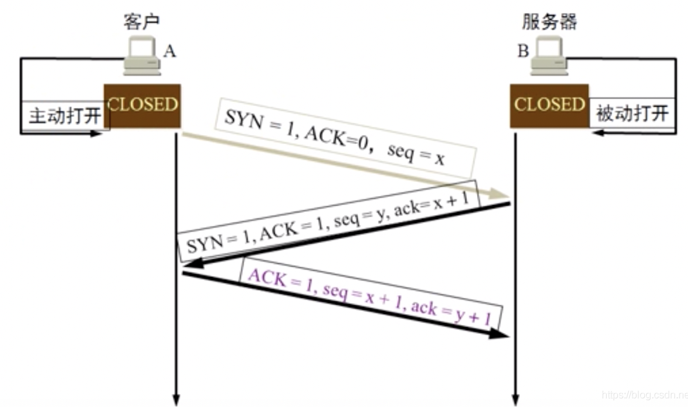
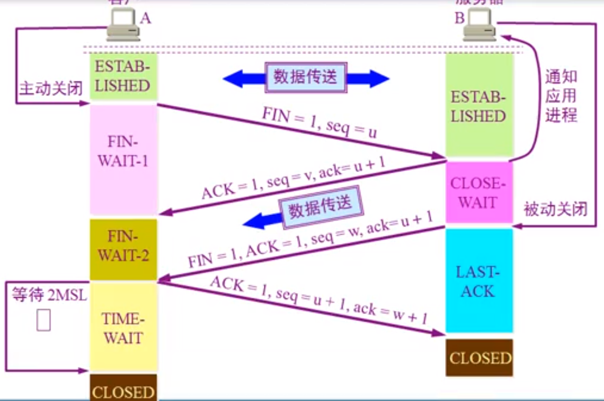

## Computer-Network ##
### 因特网 
网络：许多计算机连接在一起
互联网：许多网络连接在一起（internet）
因特网：全球最大的一个互联网(Internet)   TCP/IP协议

### 因特网的组成 
边缘部分：
1. 通信方式：客户服务器（C/S）、对等方式（P2P）

核心部分：
1. 数据交换：
    + 电路交换（交换机）：适合数据量很大的实时性传输
    + 报文交换：不分段，整体交换
    + 分组交换：可以走不同的路径 
2. 广域网：应用了广域网技术
   局域网：应用了局域网技术
### 计算机网络性能：
  1. 速率：主机在计算机网络上数字信道上传送数据位数的速率  比特率 （kb/s Mb/s Gb/s）
  2. 带宽：数据通信领域中，数字信道所能传送的最高数据率
  3. 吞吐量：在单位时间内通过某网络的数据量
  4. 时延：发送时延、传播时延、处理时延、排队时延
  5. 时延带宽积：传播时延×带宽
  6. 往返时间：从发送方发送数据到接收方回复确认（RTT）  cmd: ping  网关
  7. 利用率：信道利用率、网络利用率
### OSI七层模型：分层后有利于标准化，降低相互之间的依赖（高内聚低耦合）
   + **应用层：能够产生网络流量能够和用户交互的应用程序**
     1. 域名系统DNS：将域名解析成IP地址   
     - 域名的跟 .（点）  
     - 顶级域名 .com .edu .org  .cn .net  .gov
     - 二级域名 baidu  inhe
     - 三级域名 www.dba.inhe.com的 dba
     2. 域名解析过程：根DNS知道顶级域名DNS服务器的IP地址   
     3. DHCP 动态主机配置
     - 静态IP地址：IP固定
     - 动态IP地址：用DHCP协议分配
     - DHCP请求IP地址过程：
     4. 文件传输协议FTP：创建2条通信  一条用于控制连接，用于发送FTP命令信息，标准端口为21；一条用于数据连接，用于上传、下载数据，标准端口为20
     - 主动模式：FTP客户端告诉FTP服务器侦听端口  FTP服务器主动连接FTP客户端进行数据传输
     - 被动模式：FTP服务端在指定范围内的某个端口被动等待FTP客户端发起连接
     - FTP传输模式：
         - 文本模式：ASCII模式，以文本序列传输数据
         - 二进制模式：Binary模式，以二进制序列传输数据
     5. 远程终端协议TELNET：远程进行命令传输，默认使用TCP的23端口
     - net user han a! /add  创建一个用户
     - net user administrator a1!  重设密码为a1!
     - net localgroup administrators han /add  加一个han 管理员
     - shutdown -r -t 0  立即关机
     6. 远程桌面协议RDP：远程使用图形端口连接  3389
     7. 超文本传输协议HTTP： URL一般形式：<协议>://<主机>:<端口>/<路径>   对于网站的标识可以使用不同的端口、不同的IP地址、不同的主机头（域名）
     8. 使用Web代理服务器访问网站
     - 节省内网访问Internet的带宽
     - 通过Web代理绕过防火墙
     9. 电子邮件(SMTP发电子邮件、POP3收邮件、IMAP收邮件)
     
   + **传输层：可靠传输建立会话（看电影）  不可靠传输不建立会话（QQ对话）  流量控制** 
     1. TCP协议：分段、编号、流量控制功能、建立会话、可靠连接   传送的是运输协议数据单元是TCP报文段
     2. UDP协议：一个数据包就能完成数据通信、不建立对话、多播、不可靠连接  传送运输协议数据单元是UDP报文或者用户数据报
     3. 传输层与应用层的关系：http=TCP+80端口  https=TCP+443 DNS=UDP+53
     4. 端口代表服务 -> 更改端口增加服务器安全
     5. Windows防火墙作用：主动的请求进不来，自己的请求可以返回
     6. 一些比较熟知的端口号：FTP：21；TELENT：23；SMTP：25；DNS：53；HTTP：80；https：443；RDP：3389
     7. UDP组成：首部（伪首部 ｛源IP地址4位、目的IP地址4位、0、17、UDP长度2位｝+ 12位字节、源端口2位、目的端口2位、长度2位、校验和2位） + 数据
     - 主要特点：UDP不需要提前建立连接、尽最大努力交付、无拥塞控制、支持单播和广播、首部开销小、面向报文的运输层协议
     8. TCP特点：面向连接的运输层协议、只能是点对点连接、提供可靠交付、全双工通信   
     - 点对点连接：TCP连接的端点叫套接字（IP地址：端口号）
     - 可靠交付：停止等待协议（有差错时超时重传） -> 通常称为**自动重传请求ARQ**  信道利用率低  -> 改为流水线传输（传输不停止） 以字节为单位的滑动窗口技术
     - **TCP报文段：TCP首部 [长度不固定 -> 20字节固定 + 可变部分] （16位源端口 + 16位目的端口 + 32位序号seq + 32位确认号ack + 4位的数据偏移 + 6位保留 + 1位URG（优先级）+1位ACK（决定确认号是否有效 + 1位PSH（直接推送） +1位RST（重新传输） + 1位SYN（建立会话请求） +1位FIN（释放连接）+ 16位窗口（接收缓存容量 + 16位检验和 + 16位紧急指针（URG=1才有用  决定紧急处理的字节范围）+ 可变不补分 ）+ TCP数据部分**
     9. TCP的流量控制：控制点对点的通信量，抑制发送端的发送速率  接收端主动调整滑窗大小，发送端根据接收端发送的报文调整相应的滑窗。发送端也会定时发送报文向接收端确认滑窗信息，避免接收端发送的相关调整滑窗大小的报文丢失带来的影响。
     10. TCP的拥塞控制：流量控制往往指在给定的发送端和接收端之间的点对点通信量的控制，它所要做的就是抑制发送端发送数据的速率，以便使接收端来得及接收​  慢开始和拥塞避免，发送方维持拥塞窗口cwnd
     11. TCP的传输连接管理：三个阶段（ 建立连接（三次握手） 、数据传送和连接释放 [四次分手]  ）
     
   + **网络层：IP地址编址  选择最佳路径**
     1. 网络层向运输层提供的两种服务：
     * 虚电路服务：只是一条逻辑上的连接（静态路由）
     * 数据报服务：提供简单灵活的、无连接的、尽最大努力交付于的数据报服务（动态服务）
     2. 网际协议IP：
         + 虚拟互联网：中继系统（中间设备）-> 转发器（物理层）、网桥（数据链路层）、路由器（网络层）、网关（网络层以上）  网际协议IP是TCP/IP两个主要协议之一，与IP配合使用的还有四个协议：ARP(RARP)、ICMP、IGMP
         + IP地址：32位的IP地址分为网络ID和主机ID
             - A类地址：1-126
             
             - B类地址：128.1-191.255    
             
             - C类地址：192.0.1-223.255.255    （等分2\4\8个子网   变长子网划分）
             
             - 子关掩码：255为网络部分/0为主机部分    作用：告诉计算机网络部分和主机部分    子网划分技术：网关一般是此网段的第一个地址   **C类分网段方法（等分和不等分[变长子网划分]）**   特例：点对点的子关掩码 255.255.255.252/30
             
             - 超网：合并网段   能让不同网段的网连接起来
             
             - IP地址+MAC地址：{ [ 数据段或消息+源IP地址+目标IP地址 ] -> 数据包 | + 源MAC+目标MAC } -> 数据帧
             
             - ARP协议：通过广播负责把IP地址解析成MAC地址
             
             - 数据报：首部的前一部分为固定长度，共20字节；后半部分可选字段
             
             - 固定部分字段：版本（IPv4还是IPv6）4位、首部长度（确定首部长度）4位、区分服务（优先级）8位、总长度（数据报）16位、标识（计数器|多一份数据报就+1）16位、标志（分片情况）3位、片偏移（某片在原分组的相对位置）13位、生存时间（TTL/可通过路由器的最大值）8位、协议（数据使用哪种协议）8位、首部校验和（检验首部有没有错误）16位、IP源地址32位、IP目标地址32位
             - IP转发分组流程   网络畅通条件：数据包能去能回（静态路由配置）
             - 网关就是默认路由（信息网络的出口） 查看路由表 route print / netstat -r
             - 网络负载均衡：指定一条路线去一条路线回
             - ICMP：提高IP数据报交付成功的机会  报文格式：类型8位、代码8位、检验和16位、数据部分（取决于类型） -> 类型：ICMP差错报告报文和ICMP询问报文
                 * 差错报告报文：终点不可达、源点抑制、时间超过、参数问题、改变路由
                 * 询问报文：回送请求和回答报文、时间戳请求和回答报文
             - RIP（动态路由协议）: 周期性广播   不考虑带宽只考虑跳数  最大跳数15跳
               
               OSPF（内部网关协议）：开放式最短路径优先协议  根据带宽选择路径  触发式更新  支持多区域  tracert IP
               BGP（外部网关协议）：不同自治系统的路由器之间交换路由信息的协议   VPN拨号  ***NAT —> 网络地址转换技术：***   端口映射：让外网的人通过公网能够访问私网的服务器
             - IGMP组播协议：管理组播成员   点到点通信：对于广播 -> MAC地址全是F 目标IP地址全是255  全网广播不能跨越路由器      组播=多播：分组广播
     
+ **数据链路层：数据如何封装 添加物理层地址（MAC地址）**
       1. 主要使用的信道：①点对点信道；②广播信道（一对多）
           2. 链路：一条点对点的物理线段，一条通路的组成部分；数据链路：要有通信协议控制数据传输（硬件、软件） -> 链路上即数据链路
           3. 传送数据形式：帧  
           4. 三个基本问题：封装成帧、透明传输、差错控制
           * 封装成帧：在一段数据的前后分别添加首部和尾部然后构成了一个帧，进行帧定界(收到的帧不完整直接抛弃)
           * 透明传输：为了防止帧数据中产生帧开始符和帧结束符，会在字符“SOH”和"EOT"以及“ESC”前面插入一个"ESC"，这叫字符填充（字节填充），接收端的数据链路层将在数据送往网络成之前删除转义字符。
           * 差错校验：比特差错-->1可能变成0，0也可能变成1 --> 误码率（BER）和信噪比关系很大
               - 循环冗余检验（CRC）—> 余数（FCS）   不纠错、不要求重新传输
               - 帧检验序列（FCS）
             5. 点对点的数据链路传输：PPP协议（拨号上网  身份验证功能）  PPP协议帧格式（字节填充、零比特填充）
             6. 使用广播信道的数据链路层：以太网  带冲突检测的载波监听/碰撞检测 （CSMA/CD协议） 信道利用率    载波监听多点接入/碰撞检测机制 ：
            * 多点接入：许多计算机以多点接入的方式连接在一根总线上
            * 载波监听：检测总线上有没有其他计算机发送数据信号，避免碰撞（冲突检测和避让机制） -> 二进制指数类型退避算法  至少有64字节的测试帧  争用期为51.2微秒  争用期可发送521bit 也就是64字节帧
             7. 局域网拓扑：星形网、环形网、总线网、树形网 -> 共享通信媒体（静态划分信道、动态媒体接入控制【以太网使用的是随机接入】）
             8. 集线器：星型拓扑 连接的网是冲突域  两对双绞线  类似于网线 
             9. MAC地址：又叫硬件地址、物理地址，由48位的二进制组成  适配器从网络上每收到一个MAC帧先用硬件检查MAC帧中的MAC地址，发往本站的收下，否则丢弃。（单播帧  广播帧  多播帧）   MAC帧组成：6位（字节）目的地址 6位源地址 2位类型 46-1500位IP数据报 4位FCS
             10. 拓展以太网：物理层扩展：使用光纤和光纤调制解调器连接到集线器
               网桥（交换机）扩展：记忆功能，存储转发功能，自学习功能
               **透明网桥的生成树算法** ：避免转发的帧在网络中不断德兜圈子  作用：在任何两个站之间只有一条路径
             11. 虚拟局域网 VLAN：由一些局域网网段构成的与物理位置无关的逻辑组（分隔冲突域） 虚拟局域网帧格式是在以太网帧格式中插入一个4字节的VLAN标识符
               LAN：一个局域网
             12. 高速以太网：大于100Mb/s，100BASE-T，可在全双工方式下工作而无冲突，因此不使用CSMA/CD协议，帧格式不变
   
+ **物理层：解决如何在连接各种计算机的传输媒体上传输数据比特流**

    主要任务：确定与传输媒体的接口的一些特性，编码特性
    数据通信：奈氏准则 ->{ 码元传输速率 }（在理想条件下(无噪声/干扰/失真)，为了避免码间串扰，码元的传输速率是有上限的。如果信道的频带越宽(信号高频分量越多)，则用更高的速率传输码元也不会出现码间串扰）、**香农公式 -> { 信息传输速率 }（C = W log2(1 + S / N) b/s）**
    传输媒体：导向传输媒体（双绞线 STP/UTP    同轴电缆 50Ω  多用于数字传输和基带传输/ 75Ω 多用于模拟传输和带通传输   网线  光纤（单模光纤 / 多模光纤））、非导向传输媒体（电磁波、短波、微波）、集线器（无定向传输功能）
    信道复用技术：频分复用（FDM）、时分复用（TDM）、统计时分复用（STDM）、波分复用（WDM）、**码分复用技术（CDM）**
    数字传输技术：脉码调制（PCM）
    宽带接入技术：ADSL（非对称数字用户链路）技术、光纤同轴混合网（HFC）、FTTx技术
    常见编码方式：单极性不归零码、双极性不归零码、单极性归零编码、双极性归零编码、**曼彻斯特编码、差分曼彻斯特编码**

* TCP/IP四层模型：应用层、传输层、互联网曾、网络接近层
* 开放信息系统交换涉及：实体、协议、服务、服务访问点